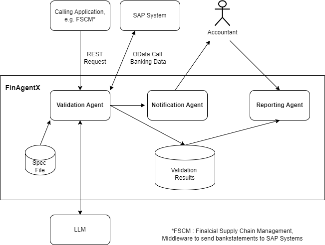

## FinAgentX

The FinAgentX is designed to enrich the valdiation of BAI2 files imported to SAP systems.
In some cases such files can be corrupted and cause problems impacting customer business.
The error analysis is difficult and time consuming. With FinAgentX identifing issues can
be heavly accelerated and the overall process can be monitored.

### Steps

Start reading
https://google.github.io/adk-docs/get-started/quickstart/

Install python add-on to VS code

python -m venv .venv
- macOS/Linux: source .venv/bin/activate
- Windows CMD: .venv\Scripts\activate.bat
- Windows PowerShell: .venv\Scripts\Activate.ps1

Call "pip install google-adk" , takes a few minutes

Call "pip install --upgrade google-genai"

Environment variables are set already on .env file (no longer subject to .gitignore)

Install Google Cloud CLI installer from here https://cloud.google.com/sdk/docs/install#windows 

Install the gcloud CLI component manager.
