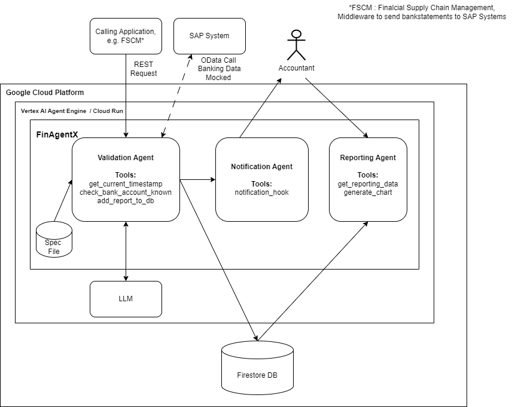

## FinAgentX

### Introduction

BAI2 files are standardized, plain-text files containing bank statement information.
They can be uploaded automatically to SAP systems via solutions like FSCM (Financial Supply Chain Management).
This usually works well, yet errors in the files can impact customer business. Identifying the
root cause can be time consuming.

The FinAgentX is designed to enrich the validation of BAI2 files imported to SAP systems, or any
other system processing such files. With FinAgentX identifying such issues can
be heavily accelerated and the overall process can be monitored and notifications are sent in case of issues. 




### Steps

Start reading
https://google.github.io/adk-docs/get-started/quickstart/

Install python add-on to VS code

python -m venv .venv
- macOS/Linux: source .venv/bin/activate
- Windows CMD: .venv\Scripts\activate.bat
- Windows PowerShell: .venv\Scripts\Activate.ps1


Call "pip install google-adk" , takes a few minutes

Call "pip install --upgrade google-genai"

Environment variables are set already on .env file (no longer subject to .gitignore)

Install Google Cloud CLI installer from here https://cloud.google.com/sdk/docs/install#windows 

Install the gcloud CLI component manager.

Setup agent starter pack : https://github.com/GoogleCloudPlatform/agent-starter-pack?tab=readme-ov-file#-get-started-in-1-minute

### Deployment to Vertex AI

Run from the repository root dir: </br>
```python agent_x/agent_engine_app.py --project=qwiklabs-gcp-01-b04f6026c908```

### Invoke agent via REST

1. Get the api token using `gcloud auth print-access-token`
2. Set the token and an arbitrary user id in the file: [API requests.http](./API%20requests.http#L1-2)
3. Execute the API calls i 